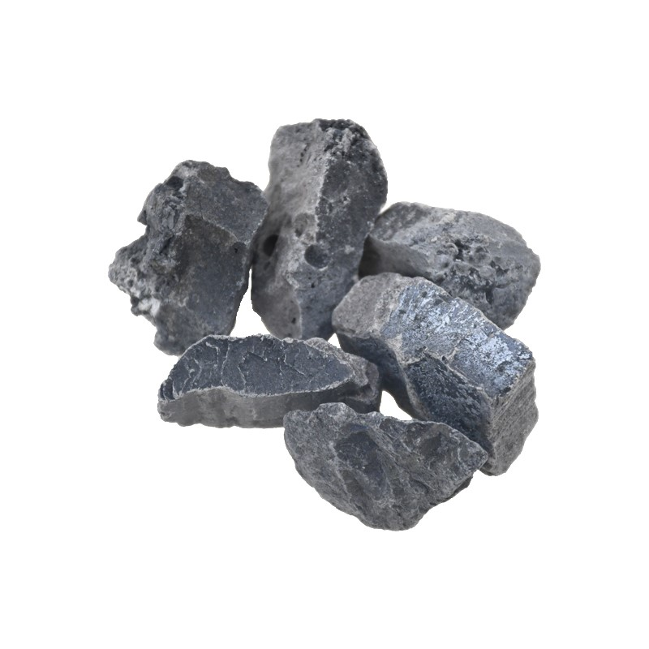
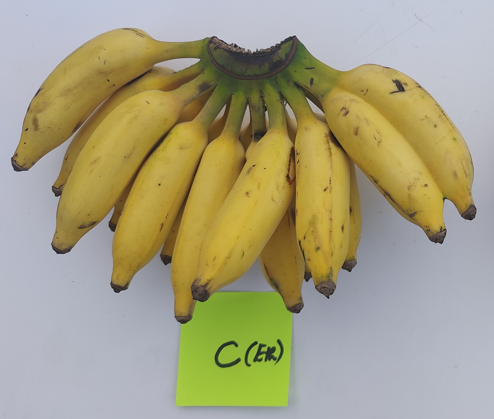
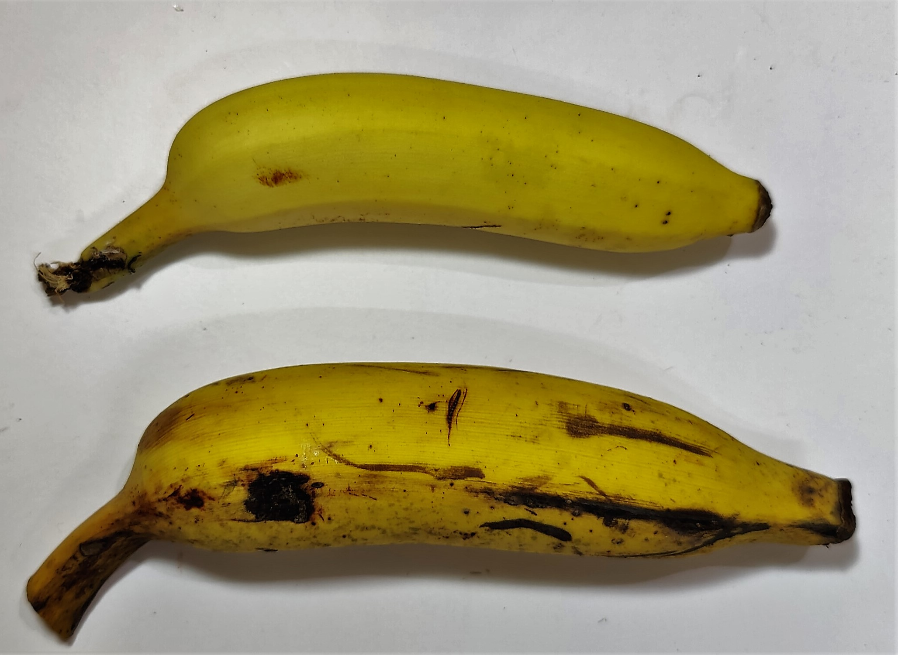
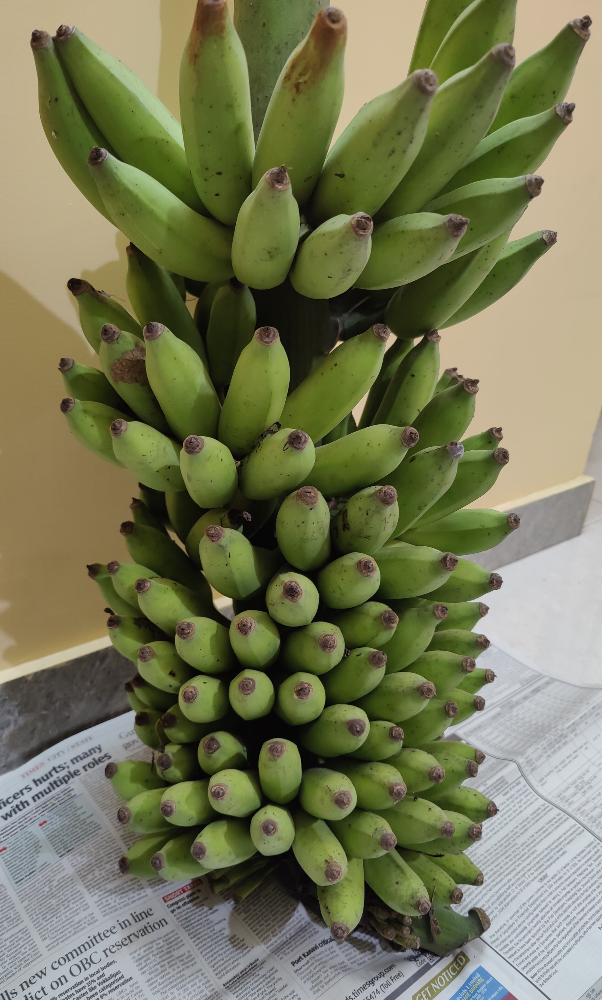
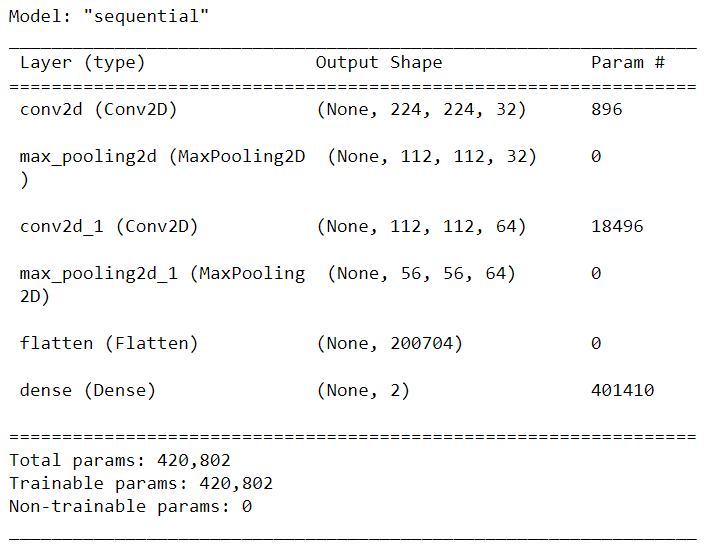
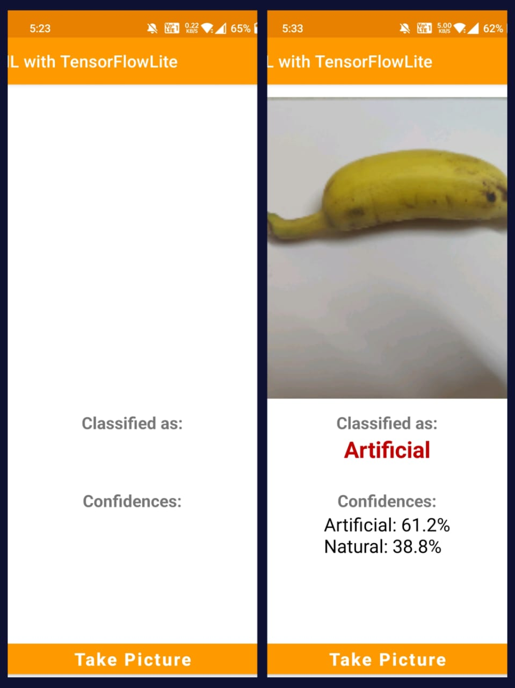

# Ripened fruits classifier

Nowadays fruits are ripened using artificial means with the help of certain chemicals like calcium carbide as a ripening agent.
This application uses an efficient image processing technique to detect artificially ripened bananas. Banana is an important fruit crop across the world. Nowadays to ripe the bananas, traders use many artificial methods (using chemicals). One of the artificial methods used is adding calcium carbide. CaC2 contains traces of arsenic and phosphorous which is the carcinogenic agent.
This system makes usage of an android smartphone that runs a TensorFlow lite CNN model to detect artificially ripened fruits. The proposed system has an efficiency of 91% in the identification of the fruits ripened artificially.

## INTRODUCTION

The fruits liberate ethylene gas augmented with respiration rate during the process of ripening. It is difficult to handle the ripe fruits as they are squashy and flimsy and they usually cannot endure the rigors during transport. Hence, these fruits are harvested in a fully mature state which is hard and green.
Climacteric fruits will continue their ripening process even after harvesting is done. The emission of ethylene is always accompanied by an increased respiration rate during the process of fruit ripening. Mango, Banana, Papaya, Guava, Kiwi, Fig, Apple, Passion fruit, Apricot, Plum, and pear are some of the climacteric fruits. Non-climacteric fruits are those which cannot ripe further after getting harvested. These fruits produce ethylene in a small amount and mostly never respond to the treatment of ethylene. Orange, Mousambi, Kinnow, Grapefruit, Grapes, Pomegranate, Litchi, Watermelon, Cherry, Raspberry, Blackberry, Strawberry, Carambola, Rambutan, and Cashew are some of the non-climacteric fruits.

Little quantity of ethylene stimulates the ripening process near consumption zones in a controlled environment of temperature and humidity. They include mango, guava, fig, apricot, banana, kiwi, apple, plum, pear, and passion fruit. The other categories of fruits are non climacteric fruits. They are harvested only when they are completely ripened. They do not react to ethylene treatment as they emit a tiny amount of ethylene. They include orange, grapes, litchi, watermelon, and blackberry.

In India, most of the climacteric fruits are ripened by making use of calcium carbide of industrial grade. Calcium carbide of industrial grade is composed of some amount of phosphorus and arsenic which are extremely harmful to humans, and, thus, usage of chemicals for fruit ripening is considered illegal. The proposed system makes usage of an android smartphone that runs a TensorFlow lite CNN model to detect artificially ripened fruits. The proposed system has an efficiency of 91% in the identification of the fruits ripened artificially.

## ARTIFICIAL RIPENING

Unsaturated hydrocarbons like acetylene and ethylene promote ripening and induce color changes in fruits when used for the ripening process.
Calcium carbide when pure is colorless otherwise it is greyish-white to black which produces a garlic odor..The following reaction, CaC2 + 2 H2O --> C2H2 + Ca(OH)2 shows how calcium carbide reacts with water to produce ethylene gas an artificial fruit ripening agent. This calcium carbide is cheaper and easily available in the market thus it becomes more viable for all the sellers to use this chemical for ripening fruits.

Those fruits ripened artificially with calcium carbide has a uniform and attractive color on the surface through the tissues inside the fruit may or may not be ripened and may even remain green and raw.



<p style="text-align:center">
Artificially ripened bananas.
</p>


<p style="text-align:center">
Naturally ripened bananas.
</p>



<p style="text-align:center">
Side by side view of artificially and naturally ripened banana.
</p>

## DATA PREPARATION

A bunch of unripened elakkai bananas was obtained from a known farmer at a very unripened stage. The bunch contained roughly 150 bananas (13 hands), four hands were ripened artificially using CaC2, and the other 4 hands were ripened using ethrel which is a versatile plant growth regulator which improves coloration and accelerates uniform ripening of fruits like pineapple, mango, tomato, etc. It is relatively harmless compared to CaC2 and the rest were left on their own in dark and warm storage so they can ripe naturally. The artificial ripening process was very quick, fruits were completely colored within 3 days, whereas the natural ripening took about 16 days in total. In the natural ripening process, the bananas were not ripened uniformly whereas the artificial ones were ripened uniformly.



<p style="text-align:center">
Banana bunch
</p>


<p style="text-align:center">
Day three comparison between chemically treated banana and untreated banana
</p>

Images of fruits were collected from 360 degrees at the final stage of ripeness, videos were also shot using a 60fps HD camera and the videos were converted to images using OpenCV.
There were videos worth 3 GB, and every 30th frame of the image was exported as an image using OpenCV python in the end there were 1904 naturally ripened images and 1319 artificially ripened images. Images were divided into ratios of 9: 1: 1 namely training, test, and validation set

```py
import os
import shutil
import random
import glob
import matplotlib.pyplot as plt
import warnings
IMG_DIR_PATH = "C:/Users/inba2/Documents/BananaDataSet/"
TRAIN_N = .8
TEST_N = .1
VAL_N = .1
DIRS = ['Carbide', 'Etheral', 'Natural']
IMG_COUNT = {
    DIR: len(os.listdir(os.path.join(IMG_DIR_PATH, DIR)))
    for DIR in DIRS
}
os.chdir(IMG_DIR_PATH)

if os.path.isdir('train/natural') is False:
    os.makedirs('train/natural')
    os.makedirs('train/artificial')
    os.makedirs('valid/natural')
    os.makedirs('valid/artificial')
    os.makedirs('test/natural')
    os.makedirs('test/artificial')

    for i in random.sample(glob.glob('Carbide\Carbide*'), int(IMG_COUNT["Carbide"]*TRAIN_N)):
        shutil.move(i, 'train/artificial')
    for i in random.sample(glob.glob('Etheral\Etheral*'), int(IMG_COUNT["Etheral"]*TRAIN_N)):
        shutil.move(i, 'train/artificial')
    for i in random.sample(glob.glob('Natural\Natural*'), int(IMG_COUNT["Natural"]*TRAIN_N)):
        shutil.move(i, 'train/natural')

    for i in random.sample(glob.glob('Carbide\Carbide*'), int(IMG_COUNT["Carbide"]*TEST_N)):
        shutil.move(i, 'test/artificial')
    for i in random.sample(glob.glob('Etheral\Etheral*'), int(IMG_COUNT["Etheral"]*TEST_N)):
        shutil.move(i, 'test/artificial')
    for i in random.sample(glob.glob('Natural\Natural*'), int(IMG_COUNT["Natural"]*TEST_N)):
        shutil.move(i, 'test/natural')

    for i in random.sample(glob.glob('Carbide\Carbide*'), int(IMG_COUNT["Carbide"]*VAL_N)):
        shutil.move(i, 'valid/artificial')
    for i in random.sample(glob.glob('Etheral\Etheral*'), int(IMG_COUNT["Etheral"]*VAL_N)):
        shutil.move(i, 'valid/artificial')
    for i in random.sample(glob.glob('Natural\Natural*'), int(IMG_COUNT["Natural"]*VAL_N)):
        shutil.move(i, 'valid/natural')
```

`OpenCV script to convert a video to images`

## PROPOSED SYSTEM

In the proposed system a CNN(Convolutional Neural Network) is used for image classification. CNN model is trained using a training dataset. The trained model is then converted
into a TFLite graph which is designed for devices with less computational power such as Mobile Devices. The converted TFLite graph is imported to the android project in IDE then it is integrated and synced. Android project is built to get a .apk file which can be installed on any android device. This .apk file is deployed and made available for everyone to install and use it. After installing the android application it will ask permission to access the camera. Image is captured using the mobile phone’s camera and fed to the trained tflite graph. The graph takes the image as input and gives the result as an output. This result will be displayed on the device’s screen

## IMPLEMENTATION DETAILS

The convolutional neural network is a class of deep learning neural networks. This is widely used in image classification, feature extraction, and computer vision. It does not require heavy preprocessing of input images and it can be executed on GPU using parallel processing computation technique resulting in faster building and training of models. CNN model consists of layers that can be classified into three types called the input layer, the hidden layer, and an output layer. The hidden layer is made up of a convolutional layer, pooling layer, connected layer, loss layer, etc. each designed to perform specific operations. The working of the model is iterative and it divides the image into several portions and performs an individual operation for each portion. The output of one node is input to the next layer. Performing this operation repeatedly and updating properties of each node i.e. weight, the bias will train the model.

As shown in the above figure the CNN Architecture consists of Convolutional and max-pooling layers which act as a feature extractor and the fully connected layer which performs non-linear transformations on the extracted features and acts as the classifier along with the output layer.

The trained CNN(convolutional Neural Network) model is large and complex and it is not suitable to run on mobile divides. TFLite is a helpful tool made by Tensorflow to convert the complex TensorFlow models into the smaller and less complex model which runs on small devices. Android App which is the heart of the project is developed using Android Studio SDK. The algorithm reads the image and classifies it into different classes. The calculated class is displayed on the device’s screen.



<p style="text-align:center">
Model summary
</p>
## RESULTS

The model is trained for 10 epochs with an Adam optimizer with a final test accuracy of 97% and a training accuracy of 100%. As we can see the model is overfitting, that's because the number of images is too less. In the future, we can perform this experiment on a larger scale and collect a large amount of data and rebuild this model.



<p style="text-align:center">
Model summary
</p>


<p style="text-align:center">
Confusion matrix, without normalization
</p>

## CONCLUSION AND FUTURE SCOPE

To quicken the ripening process vendors and farmers use chemicals like CaC2. Consuming such fruits is harmful to human health as it can cause headaches, throat irritation, and stomach irritation. As of now the data available for this classification is very little, in the future we can perform this experiment on a large scale not only for bananas but for all the other fruits and expand this application, also an alternative and new algorithms may be used to get high accuracy.
